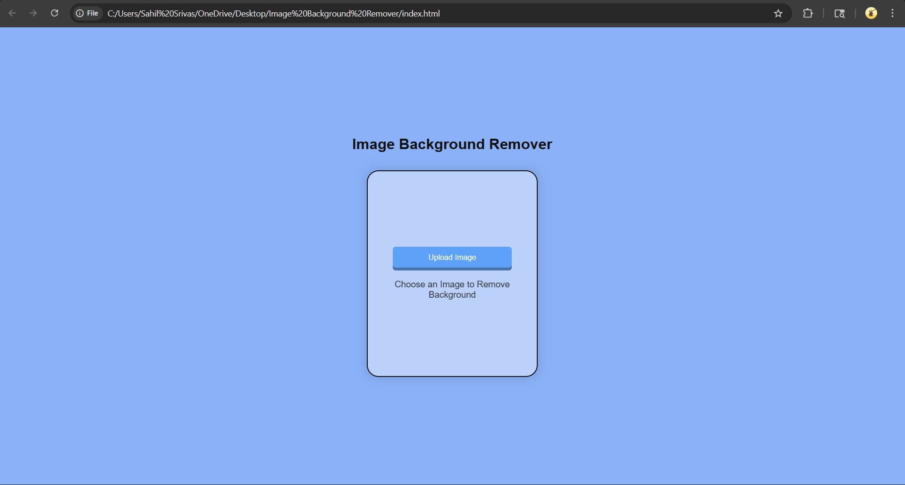
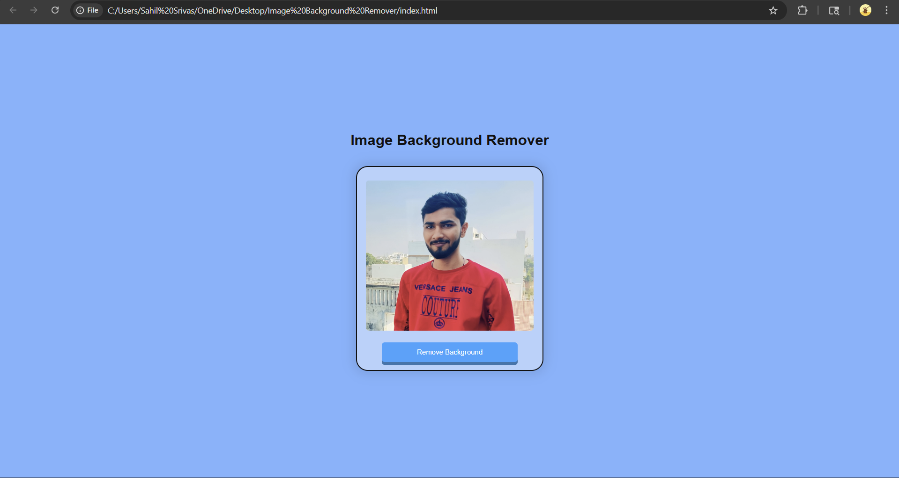
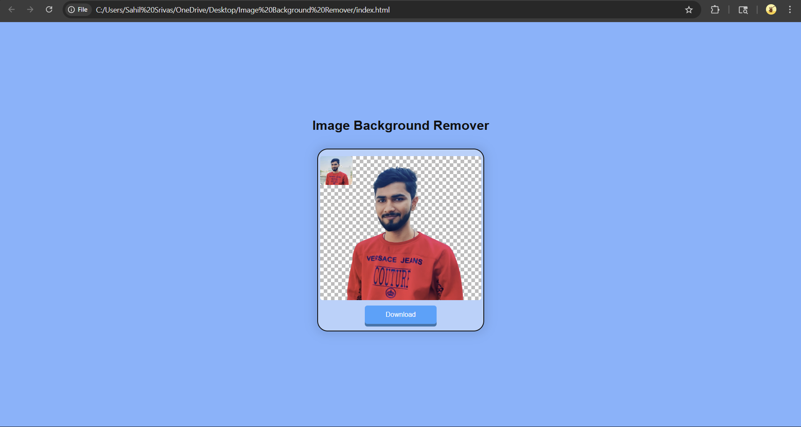

# 🖼️ Image Background Remover

✨ A simple web-based tool to remove image backgrounds and generate clean, transparent outputs quickly and efficiently.

---

## 🚀 Live Demo

🔗 https://image-background-remover-sahil.vercel.app

---

## ✨ Features

- 🖼️ Upload any image easily  
- ✂️ Remove background in one click  
- ⚡ Fast and lightweight  
- 🎨 Clean and simple UI  
- 💾 Download processed image  

---

## 🛠️ Tech Stack

- HTML  
- CSS  
- JavaScript  

---

## 📂 Project Structure
    Image_Background_Remover/
    │
    ├── index.html
    ├── style.css
    ├── script.js
    ├── Screenshot1.png
    ├── Screenshot2.png
    ├── Screenshot3.png
    └── README.md
    
---

## 📸 Screenshots

### 🖼️ Input

### ✂️ Processing

### ✅ Output

---

## ⚙️ How to Run Locally

1️⃣ Clone the repository  

    git clone https://github.com/Sahil-Shrivas/Image_Background_Remover.git
      cd Image_Background_Remover

---

### 🤝 Contributing
Feel free to fork this repo and contribute!

---

### ⭐ Support
If you like this project, don't forget to give it a ⭐.
